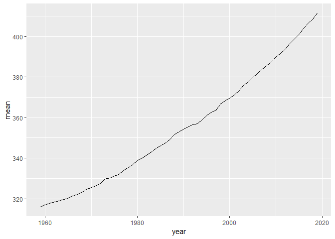

Script8
================

## Case Study \#8

The goal of this case study is to download data from the web, do stuff
with it, and then output a file in multiple formats.

``` r
library(data.table)
data8 <- read.csv('ftp://aftp.cmdl.noaa.gov/products/trends/co2/co2_annmean_mlo.csv',skip=55,header=TRUE)
```

## Our Data

Our Data is Mauna Loa CO2 data (annual means) since 1959. Let’s display
this in a graph.

<!-- -->

| year |   mean |  unc |
| ---: | -----: | ---: |
| 1959 | 315.98 | 0.12 |
| 1960 | 316.91 | 0.12 |
| 1961 | 317.64 | 0.12 |
| 1962 | 318.45 | 0.12 |
| 1963 | 318.99 | 0.12 |
| 1964 | 319.62 | 0.12 |

Let’s see if this works\!
